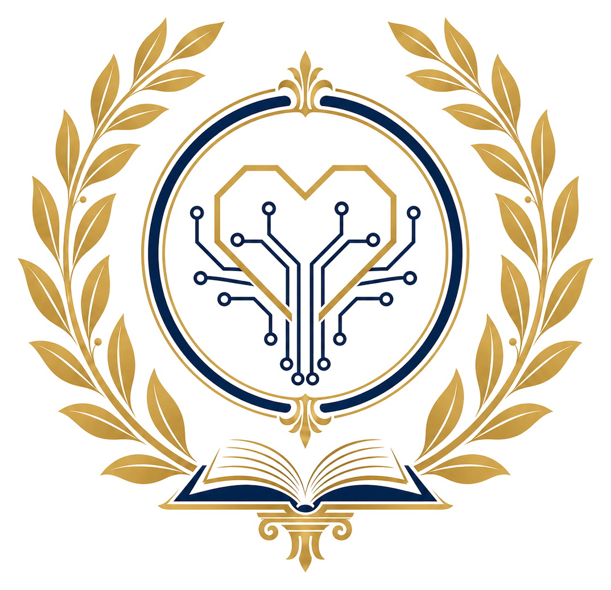

# VAMURTECH

**VAMURTECH** is a motto project based on a Latin canon, its translations, and a symbolic emblem.

## Canonical Motto

> **Vita brevis; ars longa, memoria servata usuque renovato; amor per artes technicas longas omnia vincit.**

## Short Meaning

Human life is brief; art, knowledge, craft, and technology endure.  
Memory is preserved, while use and practice are renewed.  
Through long technical arts, love overcomes all things.

## Source Sayings

This motto consciously grows from two classical sayings:

> **Vita brevis; ars longa.**  
> **Amor omnia vincit.**

The motto keeps both origins visible, while giving them a new technical and informational meaning.

## Name

**VAMURTECH** is used as the short name of this motto project.  
It is associated with the domain:

> **vamur.tech**

## Documents

- [Latin Canon](motto.md)
- [Japanese Translation and Commentary](ja.md)
- [English Translation and Commentary](en.md)
- [Esperanto Translation and Commentary](eo.md)

## Concept

VAMURTECH joins four ideas:

1. **Brief life** — each human life is finite.
2. **Long art and technique** — knowledge, craft, and technology can continue across generations.
3. **Preserved memory** — works, data, knowledge, and records can be copied, transmitted, and protected.
4. **Renewed use** — tools, media, methods, and paradigms change over time.

The central idea is that technology should not be merely a force of efficiency or power.  
It should be guided by love, directed toward preservation, renewal, learning, and human flourishing.

## Logo

The emblem combines a heart, circuit lines, a laurel wreath, an open book, and a classical base.

- The **heart** represents love.
- The **circuit lines** represent technical arts, engineering, computation, and information.
- The **laurel wreath** represents classical learning, honor, and continuity.
- The **open book** represents memory, knowledge, documentation, and transmission.
- The **circular form** represents continuity and the long life of art and technology.

## License and Official Status

The materials are distributed under the MIT License.
Modified versions, derivative works, forks, or redistributed copies should not be presented as the official VAMURTECH canon or as the official publication of the VAMURTECH project unless approved by the project maintainer.

See [License](LICENSE.md) and [Notice](NOTICE.md).

## Canon Status

This site treats the Latin text as the canon and the other language versions as auxiliary translations and explanations.
